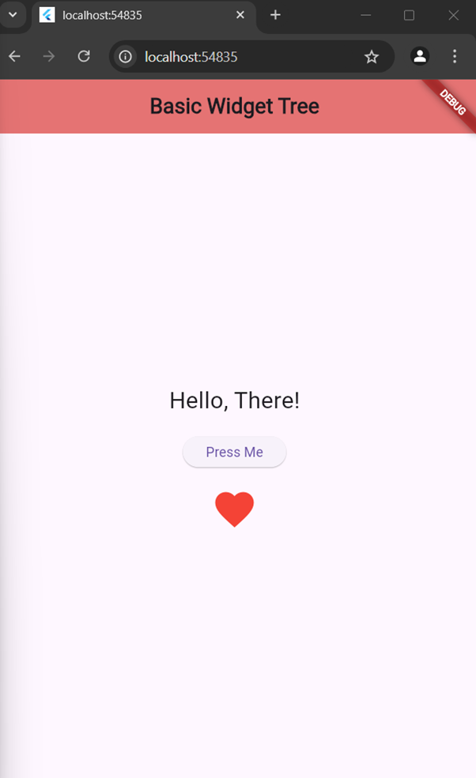

# Basic Flutter Widget Tree Application

This is a simple Flutter application that demonstrates a basic widget tree consisting of an `AppBar`, `Text`, `Button`, and `Icon` widget as required in Task 1 of lab 4.

## Features

- **AppBar**: A top bar that includes the title of the application.
- **Text**: Displays a message "Hello, There!".
- **Button**: A button labeled "Press Me", which can trigger an action when pressed.
- **Icon**: A heart-shaped icon that is displayed below the button.

## Screenshot

Here is a screenshot of the application in action:



## Installation

1. Clone this repository to your local machine.

   ```bash
   git clone https://github.com/jtareen/lab4-task1
